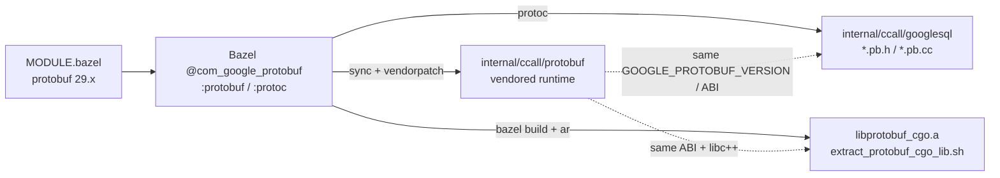

# Phase 1: Protobuf C++ alignment (Tier B, no amalgamation roadmap)

This document is **Phase 1 only**: establish a single, coherent protobuf C++ domain for Tier B—**vendored runtime headers**, **generated GoogleSQL protos**, and **`libprotobuf_cgo.a`**—all matching the **Bazel Central Registry (BCR) `protobuf` module** pinned in the GoogleSQL workspace (currently **29.x**, e.g. `29.0` in [`MODULE.bazel`](/home/brighten-tompkins/Code/googlesql_workspace/go-googlesql/internal/cmd/updater/googlesql/MODULE.bazel)).

Later phases (not covered here) address broader “no amalgamation” migration; Phase 1 stops at **version and ABI alignment** for protobuf + libc++.

## Problem statement

Tier B links a **prebuilt** archive (`libprotobuf_cgo.a`) built by Bazel from `@com_google_protobuf`. Separately, CGO compiles against **vendored** headers under `internal/ccall/protobuf` and **generated** `internal/ccall/googlesql/**/*.pb.{h,cc}`. If any leg drifts—different `GOOGLE_PROTOBUF_VERSION`, different `protoc` codegen, or mixed `std::__1::` vs `std::__cxx11::`—you get link failures or subtle runtime bugs. Phase 1 makes those three artifacts describe **one** protobuf C++ runtime.

## Prerequisites

| Requirement | Notes |
|-------------|--------|
| **Repository** | `/home/brighten-tompkins/Code/googlesql_workspace/go-googlesql` |
| **Bazel** | `bazelisk` or `bazel` on `PATH` |
| **Compilers** | `clang` / `clang++` (extract script and docs assume Clang) |
| **libc++** | Tier B objects use **libc++**; ensure `-lc++` / `-lc++abi` resolve (see `/home/brighten-tompkins/Code/googlesql_workspace/go-googlesql/docs/prebuilt-cgo.md`) |
| **GoogleSQL submodule** | Bazel runs from `/home/brighten-tompkins/Code/googlesql_workspace/go-googlesql/internal/cmd/updater/googlesql` |

**Source of truth for protobuf version:** `/home/brighten-tompkins/Code/googlesql_workspace/go-googlesql/internal/cmd/updater/googlesql/MODULE.bazel` — `bazel_dep(name = "protobuf", version = "…", repo_name = "com_google_protobuf")`.

## Step-by-step tasks

### 1. Understand the alignment pipeline

Read (short):

- `/home/brighten-tompkins/Code/googlesql_workspace/go-googlesql/docs/protobuf-vendoring.md` — single-owner protobuf, amalgamation context
- `/home/brighten-tompkins/Code/googlesql_workspace/go-googlesql/docs/prebuilt-cgo.md` — **Alignment workflow** subsection and `libprotobuf_cgo.a` contents

### 2. Prime Bazel so the external protobuf tree exists

From `internal/cmd/updater/googlesql` (full path: `/home/brighten-tompkins/Code/googlesql_workspace/go-googlesql/internal/cmd/updater/googlesql`), ensure a build has populated `output_base/external/…` for `@com_google_protobuf` (the sync script expects `protobuf~` or `com_google_protobuf` under the Bazel output base). The sync script’s header comment suggests building `@com_google_protobuf//:protobuf` first; regeneration builds `@com_google_protobuf//:protoc` if `PROTOC` is not set.

### 3. Refresh vendored protobuf runtime (headers + sources under vendor tree)

From repo root:

```bash
make sync-protobuf-vendor-from-bazel
```

This runs `scripts/sync-protobuf-cpp-runtime-from-bazel.sh` (`/home/brighten-tompkins/Code/googlesql_workspace/go-googlesql/scripts/sync-protobuf-cpp-runtime-from-bazel.sh`), which `rsync`s from the Bazel external checkout into `internal/ccall/protobuf/google/protobuf`.

### 4. Reapply amalgamation guards and patches

```bash
go run ./internal/cmd/vendorpatch
```

Rebase or update files under `internal/ccall/protobuf/patches/` if `git apply` fails after a large upstream bump (noted in the sync script).

### 5. Regenerate GoogleSQL C++ protos with matching `protoc`

```bash
make regenerate-googlesql-cpp-protos
```

This invokes `scripts/regenerate-googlesql-cpp-protos.sh`, which uses `PROTOC` if set, else builds `@com_google_protobuf//:protoc` in the submodule and regenerates `internal/ccall/googlesql/**/*.pb.{h,cc}` with consistent `-I` paths.

### 6. Verify macro-level alignment (optional strict CI gate)

```bash
make verify-protobuf-tier-b-alignment
# Fail the step on mismatch:
VERIFY_PROTOBUF_TIER_B_STRICT=1 make verify-protobuf-tier-b-alignment
```

Implementation: `scripts/verify-protobuf-tier-b-alignment.sh` compares `GOOGLE_PROTOBUF_VERSION` in vendored `internal/ccall/protobuf/google/protobuf/stubs/common.h` with the `protobuf` module version line in `MODULE.bazel` and warns below the 5.29.x line.

### 7. Build `libprotobuf_cgo.a` (Bazel protobuf + WKT + deps)

From repo root:

```bash
make extract-protobuf-lib
```

This runs `internal/ccall/go-protobuf/protobuf/extract_protobuf_cgo_lib.sh`, producing arch-specific archives under `internal/ccall/go-protobuf/protobuf/lib/` (see `docs/prebuilt-cgo.md`).

Related Makefile targets: `Makefile` — `extract-protobuf-lib`, `prebuilt-libs`, `verify-prebuilt-protobuf`.

### 8. Verify CGO link with libc++ and Tier B tags (go-protobuf scope)

**Toolchain:** use **`CGO_CXXFLAGS_TIER_B`** (default `-stdlib=libc++` in the Makefile) so CGO C++ matches Bazel’s libc++ archive.

**Recommended commands** (from repo root; adjust `TESTPKG` if you need a narrower pattern):

```bash
make verify-prebuilt-protobuf

CGO_ENABLED=1 \
  CGO_CXXFLAGS="-stdlib=libc++" \
  go test -tags googlesql,googlesql_tier_b -count=1 ./internal/ccall/go-protobuf/...
```

Or use the Makefile wrapper (defaults `TESTPKG` to `./`; override for go-protobuf only):

```bash
make local/test-tier-b TESTPKG=./internal/ccall/go-protobuf/...
```

`local/test-tier-b` in `Makefile` sets `CGO_CXXFLAGS` from `CGO_CXXFLAGS_TIER_B` and the same linker allowlist as other Tier-B prebuilt targets.

## Exit criteria (Phase 1 complete)

1. **`MODULE.bazel`** declares a single **`protobuf` BCR version** (e.g. 29.x) and that version is the one Bazel resolves for `@com_google_protobuf`.
2. **Vendored runtime** under `internal/ccall/protobuf` matches that resolution (post–`vendorpatch`).
3. **Regenerated** `internal/ccall/googlesql/**/*.pb.{h,cc}` were produced with **`protoc` from the same graph** (script default: Bazel-built `protoc`).
4. **`make verify-protobuf-tier-b-alignment`** passes; with **`VERIFY_PROTOBUF_TIER_B_STRICT=1`**, CI can fail on drift.
5. **`make extract-protobuf-lib`** succeeds and **`make verify-prebuilt-protobuf`** (or equivalent) confirms the archive layout expected by `internal/ccall/go-protobuf/protobuf/bind_tier_b.go`.
6. **`go test -tags googlesql,googlesql_tier_b`** over **`./internal/ccall/go-protobuf/...`** completes (compile + tests) with **libc++**-aligned `CGO_CXXFLAGS`.

## Risks and mitigations

| Risk | Mitigation |
|------|------------|
| **BCR / workspace resolution drift** | Treat `internal/cmd/updater/googlesql/MODULE.bazel` as canonical; after any bump, re-run sync → vendorpatch → regenerate → verify. |
| **Pinning an older BCR protobuf is fragile** (e.g. interactions with **`rules_java`** and transitive module pins) | Prefer upgrading the **whole** GoogleSQL/Bazel module set coherently; avoid one-off downgrades that force incompatible `rules_java`/protobuf pairs. Document any forced pin with rationale and a follow-up to unpin. |
| **Patch rebase burden** after `rsync` | Budget time for `internal/ccall/protobuf/patches/`; protobuf 29+ changed layout (e.g. `port_def.inc`; noted in sync script). |
| **libc++ vs libstdc++ mismatch** | Always Tier-B test with **`CGO_CXXFLAGS_TIER_B`** / `-stdlib=libc++` and documented `-lc++` link behavior (`docs/prebuilt-cgo.md`). |
| **OOM / long Bazel builds** | Use documented cache dirs (`GO_CACHE_ROOT`), limit `GO_BUILD_P`, and follow `/home/brighten-tompkins/Code/googlesql_workspace/go-googlesql/.cursor/skills/googlesql-stack-debug/SKILL.md` if needed. |

## Key repo paths (quick reference)

| Path | Role |
|------|------|
| `/home/brighten-tompkins/Code/googlesql_workspace/go-googlesql/internal/cmd/updater/googlesql/MODULE.bazel` | Bazel `protobuf` module version |
| `/home/brighten-tompkins/Code/googlesql_workspace/go-googlesql/internal/ccall/protobuf/` | Vendored protobuf C++ runtime |
| `/home/brighten-tompkins/Code/googlesql_workspace/go-googlesql/internal/ccall/googlesql/` | GoogleSQL `.proto` and generated `*.pb.{h,cc}` |
| `/home/brighten-tompkins/Code/googlesql_workspace/go-googlesql/internal/ccall/go-protobuf/protobuf/` | CGO bindings, `extract_protobuf_cgo_lib.sh`, Tier B `bind_tier_b.go` |
| `/home/brighten-tompkins/Code/googlesql_workspace/go-googlesql/scripts/sync-protobuf-cpp-runtime-from-bazel.sh` | Vendor sync |
| `/home/brighten-tompkins/Code/googlesql_workspace/go-googlesql/scripts/regenerate-googlesql-cpp-protos.sh` | `protoc` regeneration |
| `/home/brighten-tompkins/Code/googlesql_workspace/go-googlesql/scripts/verify-protobuf-tier-b-alignment.sh` | Version alignment check |

Paths relative to repo root match the table above (e.g. `scripts/verify-protobuf-tier-b-alignment.sh`).

## Optional: alignment data flow



---

*Phase 1 ends when the four corners—**MODULE.bazel**, **vendor tree**, **generated protos**, and **prebuilt archive**—are on one protobuf C++ revision and Tier-B `go test` for `go-protobuf` passes with libc++.*
