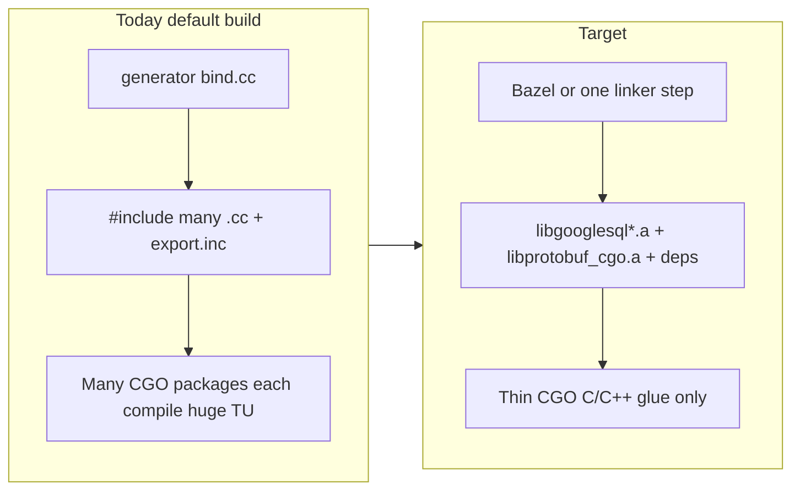

# Multi-phase plan: Tier B without amalgamation

## Current bottleneck (why builds are slow)

- Generated [`bind.cc`](internal/cmd/generator/templates/bind.cc.tmpl) **includes** long lists of `.cc` files and pulls dependency [`export.inc`](internal/ccall/go-protobuf/protobuf/export.inc) chains (protobuf, Abseil shards, ICU, etc.) into **every** CGO package. There are **hundreds** of [`export.inc`](internal/ccall/) trees under `internal/ccall/`.
- Default [`bind_linux.go`](internal/ccall/go-protobuf/protobuf/bind_linux.go) paths compile that amalgamation; [`googlesql_tier_b`](internal/ccall/go-protobuf/protobuf/bind_tier_b.go) only swaps protobuf to [`libprotobuf_cgo.a`](internal/ccall/go-protobuf/protobuf/extract_protobuf_cgo_lib.sh) and does **not** remove GoogleSQL’s own `.cc` inclusion cost.
- Tier B link failures seen in practice are largely **protobuf C++ ABI skew**: vendored [`internal/ccall/protobuf`](internal/ccall/protobuf) (~`GOOGLE_PROTOBUF_VERSION` **4023003**) vs Bazel [`MODULE.bazel`](internal/cmd/updater/googlesql/MODULE.bazel) `protobuf` **29.x** (~**5029000** in upstream `common.h`). Documented in [`prebuilt-cgo.md`](docs/prebuilt-cgo.md) and [`bind_tier_b.go`](internal/ccall/go-protobuf/protobuf/bind_tier_b.go) comments.

**Note:** [`global_exclude_replace_names: [absl, google]`](internal/cmd/generator/config.yaml) is already set under `cclib`; the remaining work is **not** primarily rename macros—it is **moving native compilation out of Go CGO** and **one coherent protobuf revision** end-to-end.

---

## Phase 1 — Single protobuf revision (blocking for any Tier B link)

**Goal:** Vendored headers, generated `*.pb.h` / `*.pb.cc`, and `libprotobuf_cgo.a` all describe the **same** protobuf C++ runtime.

1. **Pick one axis** (do not mix):
   - **Upgrade path (recommended):** Refresh [`internal/ccall/protobuf`](internal/ccall/protobuf) and **regenerate** all GoogleSQL and third-party generated protos using the **`protoc`** that matches [`internal/cmd/updater/googlesql/MODULE.bazel`](internal/cmd/updater/googlesql/MODULE.bazel) `protobuf` (29.x), per [protobuf-vendoring.md](docs/protobuf-vendoring.md) upgrade playbook.
   - **Pin path:** Attempt to pin BCR `protobuf` to an older module version that matches today’s vendor (**fragile**): a prior attempt at **23.1** broke under current **`rules_java`** / repo layout; treat pin-only as last resort unless you invest in a **dedicated mini-workspace** just for `extract_protobuf_cgo_lib.sh`.
2. **Verify:** `make extract-protobuf-lib`, then `go test -tags 'googlesql,googlesql_tier_b' -count=1 ./internal/ccall/go-protobuf/protobuf/` (see [tier-b-absl-protobuf.md](docs/tier-b-absl-protobuf.md) Phase 2).
3. **Toolchain:** Keep **libc++** for all Tier-B C++ (see [prebuilt-cgo.md](docs/prebuilt-cgo.md) — `CGO_CXXFLAGS_TIER_B`, `CGO_LDFLAGS_ALLOW` in [Makefile](Makefile)).

**Exit criteria:** `go-protobuf` package tests link cleanly with `googlesql_tier_b` and no undefined `google::protobuf::*` from version skew.

---

## Phase 2 — Abseil / archive overlap policy

**Goal:** One Abseil “owner” in the final link, consistent with protobuf.

- Follow [prebuilt-absl-overlap.md](docs/prebuilt-absl-overlap.md): `libprotobuf_cgo.a` **already embeds** Abseil objects—avoid also linking [`libabsl_cgo.a`](internal/ccall/go-absl/extract_absl_cgo_lib.sh) for the **same** binary until a dedup story exists.
- Incremental [`googlesql_tier_b_absl`](docs/prebuilt-cgo.md) pilots can stay for **non–Tier-B-protobuf** builds; document the matrix in CI.

**Exit criteria:** Written policy + CI matrix: which tags combinations are supported.

---

## Phase 3 — Expand prebuilt GoogleSQL native library (replace per-package `.cc` inclusion)

**Goal:** Stop compiling GoogleSQL (and eventually deps) inside hundreds of CGO TUs; compile **once** in Bazel (or another deterministic native build) and **link** the result.

- **Leverage existing work:** [`extract_googlesql_unified_lib.sh`](internal/ccall/go-googlesql-unified/extract_googlesql_unified_lib.sh) + [`libgooglesql-unified.md`](docs/libgooglesql-unified.md) already merge Bazel `*.pic.o` into `libgooglesql.a` with a small C ABI (`googlesql_unified_anchor`, version string).
- **Expand `GOOGLESQL_UNIFIED_BAZEL_TARGETS`** toward the closure you need (e.g. `//googlesql/public:analyzer` or smaller slices), subject to **Bazel environment** constraints noted in the doc (some targets may need credentials or extra setup).
- **Link order / duplicates:** When combining `libgooglesql*.a` with `libprotobuf_cgo.a`, apply the same duplicate-symbol discipline as overlap docs (single graph preferred).

**Exit criteria:** A **documented** list of Bazel targets that produce a static archive sufficient for a **smoke** Go binary using **only** thin CGO + prebuilts (extend beyond current base-only default).

---

## Phase 4 — Generator and CGO shape: from `#include "*.cc"` to “link-only”

**Goal:** Eliminate amalgamation as the default compilation model.

1. **New generator mode** (or parallel template) in [`internal/cmd/generator`](internal/cmd/generator): packages under `internal/ccall/go-googlesql/**` emit **`bind_prebuilt.go`** (name TBD) that:
   - Does **not** `#include` large `Sources` lists from [`bind.cc.tmpl`](internal/cmd/generator/templates/bind.cc.tmpl).
   - Restricts to **headers + bridge** + calls into symbols provided by the unified static lib / explicit C API.
2. **C bridge growth:** Extend [`googlesql_unified.h`](internal/ccall/go-googlesql-unified/include/googlesql_unified.h) (or split headers) as you expose analyzer/parser operations—today the unified doc only guarantees anchor + version.
3. **Gradual migration:** Start with **one** vertical slice (e.g. parser-only or analyzer-only), prove `go test` for a subset of packages, then widen.

**Exit criteria:** Default developer path no longer compiles megabyte-scale amalgamation TUs for migrated packages; build time dominated by **link** + **one** Bazel prebuild (cacheable in CI).

---

## Phase 5 — CI, artifacts, and developer UX

- **CI:** Extend [`.github/workflows/go-tier-b-prebuilt.yml`](.github/workflows/go-tier-b-prebuilt.yml) / unified workflow to **cache** Bazel outputs and prebuilt `.a` artifacts; optional **downloadable** prebuilts for users without Bazel.
- **Docs:** Update [README.md](README.md), [native-build-pipeline.md](docs/native-build-pipeline.md), [prebuilt-cgo.md](docs/prebuilt-cgo.md): default tags become `googlesql` + `googlesql_tier_b` (+ unified tag) when prebuilts present; amalgamation documented as **legacy**.
- **Downstream:** [tier-b-absl-protobuf.md](docs/tier-b-absl-protobuf.md) Phase 5 — align `go-googlesqlite` / `bigquery-emulator` once go-googlesql’s contract is stable.

**Exit criteria:** New contributors can build with prebuilts in minutes; full amalgamation path removed or gated behind explicit legacy flag.

---

## Risk summary

| Risk | Mitigation |
|------|------------|
| Protobuf upgrade touches huge generated surface | Mechanical regeneration + focused tests; pin `protoc` in docs/scripts. |
| Bazel full analyzer closure fails in some environments | Slice targets; document required Bazel flags/credentials; ship CI-built `.a`. |
| Duplicate symbols across archives | Single Bazel link of GoogleSQL+deps when possible; strict overlap policy ([prebuilt-absl-overlap.md](docs/prebuilt-absl-overlap.md)). |
| Long tail of 649 `export.inc` | Phased migration by package group; generator flag to switch bind style per subtree. |
