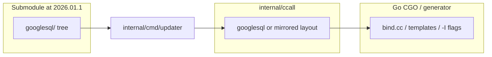

# ZetaSQL stack upgrade to `2026.01.1`

## Baseline and target

| Item | Value |
|------|--------|
| **From** | `2025.03.1` (`94ff7f5f95b42218193b61184b8797d6ae527004`) — current [internal/cmd/updater/zetasql](/home/brighten-tompkins/Code/go-zetasql/internal/cmd/updater/zetasql) |
| **To** | `2026.01.1` (`36dd14aa0657ea299725504bc0f938732f58f380`) |
| **Branches** | `refactor/upgrade-to-2026.01.1` in each repo (already used in your workspace) |

Verify after checkout: `git -C internal/cmd/updater/zetasql describe --tags --exact-match` prints `2026.01.1`.

## Why this bump is different

Upstream ships **[zetasql_to_googlesql_migration.md](https://github.com/google/zetasql/blob/2026.01.1/zetasql_to_googlesql_migration.md)** at the repo root. At `2026.01.1`, the submodule has top-level **`googlesql/`** (not `zetasql/`), headers use **`#include "googlesql/..."`**, **`namespace googlesql`**, and **`GOOGLESQL_*`** include guards — e.g. `googlesql/public/language_options.h` on the tag.

The embedding pipeline today assumes a **`zetasql/`** tree under [`internal/ccall/zetasql`](/home/brighten-tompkins/Code/go-zetasql/internal/ccall/zetasql) and copy sources from **`internal/cmd/updater/zetasql/zetasql/zetasql`** in [`internal/cmd/updater/main.go`](/home/brighten-tompkins/Code/go-zetasql/internal/cmd/updater/main.go) (see the `cp.Copy` and the walk over `outDir()/zetasql`). **That path no longer exists at `2026.01.1`**, so the updater and downstream include/CGO layout must be updated to follow **`googlesql/`** (and likely rename or mirror the ccall subtree to match upstream includes).



## Upstream reference — ZetaSQL to GoogleSQL Migration Guide

The following is the canonical upstream migration language (from `zetasql_to_googlesql_migration.md` on the release tag). Use it as the **checklist** for mechanical renames in the CGO/embed layer; **do not** blindly replace every `zetasql` string in the Go module path or public API without review.

### ZetaSQL to GoogleSQL Migration Guide

ZetaSQL is being renamed to **GoogleSQL** to unify our branding and provide a consistent experience across our ecosystems. This document provides instructions for users to migrate their projects from ZetaSQL to GoogleSQL.

#### Quick Reference Table

| Category | Old (ZetaSQL) | New (GoogleSQL) |
| :--- | :--- | :--- |
| **Project Name** | ZetaSQL | GoogleSQL |
| **GitHub Repository** | `google/zetasql` | `google/googlesql` |
| **C++ Namespace** | `zetasql` / `zetasql_base` | `googlesql` / `googlesql_base` |
| **C++ Macros** | `ZETASQL_...` | `GOOGLESQL_...` |
| **C++ Functions and Variables** | `ZetaSql...` | `GoogleSql...` |
| **Java Package** | `com.google.zetasql` | `com.google.googlesql` |
| **Java Artifacts** | `zetasql-...` | `googlesql-...` |
| **Bazel Workspace** | `@zetasql` | `@googlesql` |
| **Include Paths** | `#include "zetasql/..."` | `#include "googlesql/..."` |
| **File Names** | `ZetaSql...` / `zetasql...` | `GoogleSql...` / `googlesql...` |

#### Migration Steps for Users

##### 1. Update GitHub Remotes

The GitHub repository has been renamed. While GitHub provides redirects, we recommend updating your local git remotes to point directly to the new URL.

```bash
# Update your 'origin' remote
git remote set-url origin https://github.com/google/googlesql.git
```

If you have forks or other references, ensure they are updated to point to `google/googlesql`.

##### 2. File and Directory Renaming

We strongly recommend renaming any files or directories that contain `zetasql` in their name.

- Rename directories/files matching `*zetasql*` to replace `zetasql` with `googlesql`.
- Rename directories/files matching `*ZetaSQL*` to replace `ZetaSQL` with `GoogleSQL`.

##### 3. Search and Replace

Perform the following search and replace operations in your codebase. Completing these replacements should address most migration requirements.

- `zetasql` -> `googlesql`
- `ZetaSQL` -> `GoogleSQL`
- `ZetaSql` -> `GoogleSql`
- `ZETASQL` -> `GOOGLESQL`

> **Warning**: Ensure you exclude `.git` directories and build artifacts (e.g., `bazel-*`) to avoid corrupting your repository or build cache.

You may try to compile and test your project. If the compilation or tests fail, follow the detailed steps below and verify your build after each step.

**Step 3.1: Update Java References**

Update your dependency version to `2026.01.1`. Replace packages and artifact names:

- `com.google.zetasql` -> `com.google.googlesql`
- `zetasql-jni` -> `googlesql-jni`
- `zetasql-types` -> `googlesql-types`
- `zetasql-client` -> `googlesql-client`

The Java artifacts were previously under the [com.google.zetasql](https://central.sonatype.com/namespace/com.google.zetasql) namespace and have been moved to [com.google.googlesql](https://central.sonatype.com/namespace/com.google.googlesql). Artifacts are renamed from `zetasql-*` to `googlesql-*`. All current artifacts are:

- `googlesql-client`
- `googlesql-types`
- `googlesql-jni-channel`
- `googlesql-jni-channel-darwin`
- `googlesql-jni-channel-linux`

Replace path:

- `java/com/google/zetasql` -> `java/com/google/googlesql`

**Step 3.2: Update Build Dependencies**

GoogleSQL requires Bzlmod as of version `2025.12.1`. If you are not using Bzlmod (i.e., you are using the `WORKSPACE` system), you must migrate to Bzlmod first (see [Bazel Migration Guide](https://bazel.build/external/migration)). Check out examples to use GoogleSQL as a module [here](https://github.com/google/googlesql/tree/master/examples/bazel).

If you are using Bzlmod, update your `MODULE.bazel` file to depend on `googlesql` instead of `zetasql`.

```python
# Old
bazel_dep(name = "zetasql")
archive_override(
    module_name = "zetasql",
    ...
)

# New
bazel_dep(name = "googlesql")
archive_override(
    module_name = "googlesql",
    ...
)
```

Update Bazel references:

- `@zetasql` -> `@googlesql`

**Step 3.3: Update C++ Code**

Update namespaces, macros, includes, variable and function names:

- `namespace zetasql` -> `namespace googlesql`
- `zetasql::` -> `googlesql::`
- `zetasql_base` -> `googlesql_base`
- `#include "zetasql/` -> `#include "googlesql/`
- `ZETASQL_` -> `GOOGLESQL_`
- `kZetaSqlTypeUrlPrefix` -> `kGoogleSqlTypeUrlPrefix`
- `ZetaSqlMakeCheckOpValueString` -> `GoogleSqlMakeCheckOpValueString`
- `ZetaSqlMakeCheckOpString` -> `GoogleSqlMakeCheckOpString`

Finally, check for any remaining "zetasql" references and update them as needed.

**go-zetasql note:** This stack does not ship Java artifacts and keeps the **Go module** name `github.com/goccy/go-zetasql` unless a separate decision is made to rename it. The migration steps that apply directly are **C++ embed paths** (includes, namespaces, macros, directory layout under `internal/ccall`), optional future **submodule remote** URL updates for maintainers, and **Bazel-related** notes only if the updater’s Bazel extraction path changes with `@googlesql`.

## Phase 0 — Workspace prep (all three repos)

Per [`.cursor/commands/zetasql-stack-upgrade.md`](/home/brighten-tompkins/Code/go-zetasql/.cursor/commands/zetasql-stack-upgrade.md): for each of `go-zetasql`, `go-zetasqlite`, `bigquery-emulator`: clean or stash, `git fetch --all --prune`, checkout `refactor/upgrade-to-2026.01.1`.

Set env for planning/execution (example):

- `GO_ZETASQL_ROOT`, `GO_ZETASQLITE_ROOT`, `BIGQUERY_EMULATOR_ROOT`, `GOOGLESQL_ROOT` (sibling clone for `git log`/`diff`).

Confirm local **`replace`** lines: [go-zetasqlite/go.mod](/home/brighten-tompkins/Code/go-zetasqlite/go.mod) and [bigquery-emulator/go.mod](/home/brighten-tompkins/Code/bigquery-emulator/go.mod) point at `../go-zetasql` / `../go-zetasqlite` for stack testing.

## Phase 1 — Upstream delta (before deep debugging)

In `GOOGLESQL_ROOT` (or the submodule after fetch):

1. `git fetch --tags` and confirm `rev-parse 2026.01.1`.
2. `git log --oneline 2025.03.1..2026.01.1` and `git diff --stat 2025.03.1..2026.01.1` — scope is large; narrow reads to **`googlesql/`**, **`zetasql_to_googlesql_migration.md`**, **protos**, **resolved_ast**, **public API**, **builtins**.

**Deliverable:** add [`docs/googlesql-upgrade-delta-2025.03.1-to-2026.01.1.md`](/home/brighten-tompkins/Code/go-zetasql/docs/googlesql-upgrade-delta-2025.03.1-to-2026.01.1.md) documenting:

- How this repo maps the upstream **ZetaSQL → GoogleSQL** migration (see plan section **Upstream reference — ZetaSQL to GoogleSQL Migration Guide** above; optionally quote a short summary and point to `zetasql_to_googlesql_migration.md` on the tag).
- GoogleSQL directory / namespace / macro rename vs prior tags.
- Any new or renamed protos, `FunctionSignatureId`, `LanguageFeature`, resolved-AST nodes relevant to the Go bridge.
- Concrete go-zetasql actions: updater path changes, ccall tree layout, generator/cgo touchpoints.

## Phase 2 — go-zetasql

1. **Submodule:** In [internal/cmd/updater/zetasql](/home/brighten-tompkins/Code/go-zetasql/internal/cmd/updater/zetasql), `git fetch --tags`, `git checkout 2026.01.1`, commit submodule pointer in parent ([zetasql-submodule-policy.md](/home/brighten-tompkins/Code/go-zetasql/docs/zetasql-submodule-policy.md): tag tip only, no extra submodule commits).

2. **Updater:** Extend [`internal/cmd/updater/main.go`](/home/brighten-tompkins/Code/go-zetasql/internal/cmd/updater/main.go) so sources copy from the **`googlesql`** tree (and fix Bazel `outDir` walk keys if they moved from `zetasql` to `googlesql`). Update **`applyPostCopyOverlays`** and any hardcoded `filepath.Join(ccallDir(), "zetasql", ...)` / `::zetasql::` strings to match **`googlesql`** paths and **`googlesql::`** as needed.

3. **ccall layout:** Align **`internal/ccall`** with upstream include layout (likely **`internal/ccall/googlesql`** mirroring upstream, or a documented mapping). Update **CGO `-I` flags**, amalgamation includes, and references across [`internal/ccall/go-zetasql`](/home/brighten-tompkins/Code/go-zetasql/internal/ccall/go-zetasql), generator config ([`internal/cmd/generator/config.yaml`](/home/brighten-tompkins/Code/go-zetasql/internal/cmd/generator/config.yaml)), and templates — this is the highest-risk mechanical step.

4. **Protobuf / codegen:** Follow [docs/protobuf-vendoring.md](/home/brighten-tompkins/Code/go-zetasql/docs/protobuf-vendoring.md): sync `*.proto` from submodule **`googlesql/`** into the vendored tree, `protoc` / `gen_parse_tree` / `gen_resolved_ast` as required; use `GO_ZETASQL_SKIP_PROTOBUF_COPY=1` when preserving protobuf pin; run **`go run ./internal/cmd/vendorpatch`** (or `./scripts/apply-vendor-patches.sh`).

5. **Generator:** `go run .` from [`internal/cmd/generator`](/home/brighten-tompkins/Code/go-zetasql/internal/cmd/generator) after C++ and protos line up; refresh [`bridge.yaml`](/home/brighten-tompkins/Code/go-zetasql/internal/cmd/generator/bridge.yaml) / [`enum.go`](/home/brighten-tompkins/Code/go-zetasql/enum.go) / [`ast/node.go`](/home/brighten-tompkins/Code/go-zetasql/ast/node.go) only if the delta exposes new nodes or language features.

6. **Tests:** `CGO_ENABLED=1`, `CXX=clang++`. Canonical gate: **`make local/test`** from repo root (`TESTPKG` defaults to `./` per [Makefile](/home/brighten-tompkins/Code/go-zetasql/Makefile)). Use `TESTPKG=...` and `-p 1` / `GOMAXPROCS=1` when iterating or if memory is tight. Use [`.cursor/skills/zetasql-stack-debug/SKILL.md`](/home/brighten-tompkins/Code/go-zetasql/.cursor/skills/zetasql-stack-debug/SKILL.md) to classify sync vs link vs semantics failures.

## Phase 3 — go-zetasqlite

After go-zetasql is green locally with **`replace`**:

- Align analyzer options, **builtin registration**, and **`function_bind.go`** with new signatures or IDs from the delta.
- Add targeted **query tests** (e.g. in `query_test.go`) for any newly supported or changed behavior.
- Run: `go test -tags zetasql -count=1 -p 1 .` (or README/Makefile targets).

## Phase 4 — bigquery-emulator

With `replace` deps to local zetasql + zetasqlite:

- Extend integration tests (e.g. `server/server_test.go`) if user-visible SQL/builtins changed.
- Run **`go test -count=1 -p 1 ./...` last**, not in parallel with heavy go-zetasql runs.

## Verification order

```text
go-zetasql (make local/test) → go-zetasqlite → bigquery-emulator
```

Reuse shared `GOCACHE` / `GOMODCACHE` as in the runbook to avoid redundant CGO rebuilds.

## Execution mode

Switch from **Plan** to **Agent** mode to apply changes, run the updater, and execute tests. Commits: follow the workspace auto-commit rule (conventional commits; group related files; use `git add -p` if a file mixes unrelated hunks).
