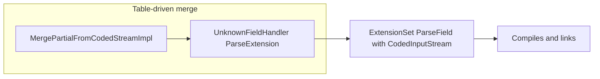

# Protobuf and third-party patch inventory

This document catalogs **go-googlesql–specific** changes layered on top of vendored Google code (primarily **protobuf**, plus a few **third-party** trees touched by the updater). It explains **why** each class of patch exists, how it interacts with [`internal/cmd/updater/main.go`](../internal/cmd/updater/main.go), and how to maintain or automate it when upgrading GoogleSQL or refreshing dependency snapshots.

## Source of truth and upgrade axis

- **Upstream GoogleSQL** pins third-party versions via Bazel. This repo mirrors those artifacts into [`internal/cmd/updater/cache/external/`](../internal/cmd/updater/cache/external/) and copies selected trees into [`internal/ccall/`](../internal/ccall/) according to `copyExternalLibMap` / `copyOutExternalLibMap` in the updater (for example `com_google_protobuf/src` → [`internal/ccall/protobuf/`](../internal/ccall/protobuf/)).
- Prefer a **single coherent revision** of protobuf for runtime headers, generated `*.pb.h` / `*.pb.cc`, and sources. Mixing files from different commits causes version checks (`PROTOBUF_MIN_*`), missing symbols, and subtle API skew.
- **`GO_GOOGLESQL_SKIP_PROTOBUF_COPY`**: when set to **`1`**, the updater **skips** copying `com_google_protobuf/src` into `internal/ccall/protobuf`, so local patches or an in-progress vendor refresh are preserved (see `copyExternalLibMapForRun()` in the updater). Use a **full** copy when intentionally refreshing protobuf from the cache.

## Stable mechanical patches (vendored headers / CGO)

**Default runtime:** protobuf object code comes from Bazel-built **`libprotobuf_cgo.a`** linked by [`bind_linux.go`](../internal/ccall/go-protobuf/protobuf/bind_linux.go) / [`bind_darwin.go`](../internal/ccall/go-protobuf/protobuf/bind_darwin.go), not from a vendored single-TU amalgamation in `go-protobuf/protobuf` (that bundle was removed).

The **`port_def.inc` / `port_undef.inc`** wrappers below remain important for **vendored** [`internal/ccall/protobuf/`](../internal/ccall/protobuf/) headers: upstream assumes one include/undef pair per header; unusual include orders (or tooling that concatenates sources) still need the guards.

### `port_def.inc` / `port_undef.inc`

- **Files**: [`internal/ccall/protobuf/google/protobuf/port_def.inc`](../internal/ccall/protobuf/google/protobuf/port_def.inc), [`internal/ccall/protobuf/google/protobuf/port_undef.inc`](../internal/ccall/protobuf/google/protobuf/port_undef.inc).
- **Mechanism**: After the standard file header comments, the main body is wrapped in:
  - `#ifdef GO_GOOGLESQL_PROTOBUF_AMALGAMATION_SKIP_PORT_DEF` / `#else` / `#endif` (port_def)
  - `#ifdef GO_GOOGLESQL_PROTOBUF_AMALGAMATION_SKIP_PORT_UNDEF` / `#else` / `#endif` (port_undef)
- **Effect**: A TU that includes `port_def.inc` **first** with the skip macros undefined sees the full macro definitions; nested includes from other headers see the skip macro set and skip the body, avoiding duplicate macro definitions and paired `#undef` issues.
- **Maintenance**: A full copy of `com_google_protobuf` **overwrites** these files and **removes** the wrappers. Re-apply them after every bulk copy, and ensure there is exactly **one** closing `#endif` for each guard (duplicate `#endif` lines cause hard-to-read preprocessor errors).

## Updater: what is automated today vs gaps

[`applyPostCopyOverlays()`](../internal/cmd/updater/main.go) runs **after** copying external trees and applies **idempotent** string fixes, including:

| Area | File(s) | What it does |
|------|---------|----------------|
| ICU | [`internal/ccall/icu/common/bytesinkutil.h`](../internal/ccall/icu/common/bytesinkutil.h) | Adds `GO_GOOGLESQL_ICU_*` include guards around the file body. |
| GoogleSQL | `internal/ccall/googlesql/public/types/BUILD` | Appends a missing proto dependency line if absent. |
| GoogleSQL | `internal/ccall/googlesql/public/functions/date_time_util.cc` | Restores an `#undef FCT` after a specific `MakeEvalError` block when missing. |

**Protobuf amalgamation:** after `applyPostCopyOverlays()`, the updater runs **`go run ./internal/cmd/vendorpatch`** from the repository root (the nested updater module cannot import [`internal/vendorpatch`](../internal/vendorpatch/) directly). That first applies [`ApplyProtobufAmalgamationPatches()`](../internal/vendorpatch/amalgamation.go) to [`port_def.inc`](../internal/ccall/protobuf/google/protobuf/port_def.inc) and [`port_undef.inc`](../internal/ccall/protobuf/google/protobuf/port_undef.inc), then [`ApplyProtobufGitPatches()`](../internal/vendorpatch/git_patch.go) (sorted `*.patch` files under [`internal/ccall/protobuf/patches/`](../internal/ccall/protobuf/patches/README.md), if any). Amalgamation is **idempotent** (if the markers are already present, files are unchanged). Git patches require **`git` on `PATH`** and unified diffs with paths relative to the repo root. Anchors for amalgamation live in [`internal/vendorpatch/amalgamation.go`](../internal/vendorpatch/amalgamation.go) (and tests); git patches must be **rebased or regenerated** when upstream edits the same lines.

**Standalone:** after a manual protobuf tree copy (without running the full updater), from the repo root run **`go run ./internal/cmd/vendorpatch`** or **[`scripts/apply-vendor-patches.sh`](../scripts/apply-vendor-patches.sh)** to apply the same logic.

**Layered edits:** capture repeatable deltas beyond amalgamation as committed **`*.patch`** files (see [Git patches](#git-patches-beyond-amalgamation) and [**Local deltas**](#local-deltas-that-may-track-upstream-over-time) below). You still reconcile large API changes with the pinned protobuf revision when upstream diverges.

## Local deltas that may track upstream over time

Some files under `internal/ccall/protobuf/` may carry **additional** edits beyond amalgamation guards—for example API surfaces that support `io::CodedInputStream` extension parsing, `ExtensionFinder` wiring, or inline helpers in headers. **On disk, search** for:

- `GO_GOOGLESQL`, `ExtensionFinder`, `CodedInputStream`-based `ParseField` overloads in [`extension_set.h`](../internal/ccall/protobuf/google/protobuf/extension_set.h) / [`extension_set.cc`](../internal/ccall/protobuf/google/protobuf/extension_set.cc) / [`extension_set_heavy.cc`](../internal/ccall/protobuf/google/protobuf/extension_set_heavy.cc).

Treat large or overlapping overload sets as **candidates to reconcile** with the exact protobuf revision pinned for your GoogleSQL upgrade: sometimes the durable fix is a **clean vendor snapshot** rather than preserving every local edit. After a refresh, **diff** these files against the new upstream and fold in only what amalgamation still requires. Prefer recording stable layers as patches under [`internal/ccall/protobuf/patches/`](../internal/ccall/protobuf/patches/README.md) so `go run ./internal/cmd/vendorpatch` reapplies them automatically after each copy.

## Symptoms of version skew (not “random compiler bugs”)

If you see errors such as:

- `#error` in generated `*.pb.h` about an **older protoc** vs headers,
- missing `PROTOBUF_*` macros or duplicate definitions from `port_def.inc`,
- missing or duplicate symbols in `ExtensionSet` / table-driven parsing,

assume **mixed revisions or incomplete post-copy patching** first. Re-copy a single protobuf tree, run **`go run ./internal/cmd/vendorpatch`** (or the updater) to restore amalgamation guards on `port_def.inc` / `port_undef.inc`, and regenerate or re-copy generated protos consistently.

## Upgrade playbook

[`internal/cmd/updater/googlesql`](../internal/cmd/updater/googlesql) must track **upstream release tags only** (no extra submodule commits). Embedding-specific fixes live under `internal/ccall/` and related tooling; see [`googlesql-submodule-policy.md`](googlesql-submodule-policy.md).

1. Update the updater **cache** / pins so `com_google_protobuf` matches the GoogleSQL release you target.
2. Run the updater with `GO_GOOGLESQL_SKIP_PROTOBUF_COPY=1` when **preserving** local protobuf edits, or unset it when **forcing** a full refresh from cache.
3. The updater applies **amalgamation** patches to `port_def.inc` and `port_undef.inc` automatically; if you skipped the updater, run `go run ./internal/cmd/vendorpatch` (or `scripts/apply-vendor-patches.sh`).
4. Run `CGO_ENABLED=1 go test -count=1 ./internal/ccall/go-protobuf/protobuf/`, then broader tests as needed.
5. Inspect `extension_set*` and any other files previously touched for merge duplication or API drift.

## Git patches (beyond amalgamation)

Optional unified diffs live under [`internal/ccall/protobuf/patches/`](../internal/ccall/protobuf/patches/README.md). The main bundle is **`01-vendor-delta.patch`**, capturing the full delta between **upstream protobuf (from the updater cache) + amalgamation** and the vendored tree; regenerate it with **[`scripts/gen-protobuf-vendor-patches.sh`](../scripts/gen-protobuf-vendor-patches.sh)** when you change vendored sources or the cache pin.

[`ApplyProtobufGitPatches()`](../internal/vendorpatch/git_patch.go) runs **`git apply`** on each `*.patch` in **sorted filename order** (use numeric prefixes for extra slices) **after** amalgamation guards are applied. Patches must use paths relative to the **repository root** (as in `git diff` from the repo root). If a patch no longer applies after a protobuf refresh, refresh the hunk from your edited tree or remove the patch if upstream absorbed the change—context drift is expected occasionally.

---

## Protobuf upgrade runbook (beyond amalgamation patches)

Use this when bumping **GoogleSQL** (and its pinned protobuf / Abseil) or when CGO fails after a vendor refresh. It complements the amalgamation rules above: first keep **one** coherent protobuf tree, then address **API** and **cross-package** skew.

### Blocking: table-driven merge and `CodedInputStream`

Amalgamation includes [`generated_message_table_driven_lite.cc`](../internal/ccall/protobuf/google/protobuf/generated_message_table_driven_lite.cc) and [`generated_message_table_driven.cc`](../internal/ccall/protobuf/google/protobuf/generated_message_table_driven.cc). Their `UnknownFieldHandler::*::ParseExtension` paths call `ExtensionSet::ParseField` with an **`io::CodedInputStream*`** (tag + stream + prototype + unknown-field sink).

Newer upstream protobuf may emphasize the **pointer + `ParseContext`** parser only. If your vendored headers drop the **`CodedInputStream` overloads**, the TU fails to compile or link even when amalgamation guards are correct.

**Preferred fix (compatibility layer):** restore or keep the **lite** overloads that delegate through `GeneratedExtensionFinder`, `FieldSkipper`, and `CodedOutputStreamFieldSkipper` (see [`wire_format_lite.h`](../internal/ccall/protobuf/google/protobuf/wire_format_lite.h)). Implement in [`extension_set.cc`](../internal/ccall/protobuf/google/protobuf/extension_set.cc) and declare in [`extension_set.h`](../internal/ccall/protobuf/google/protobuf/extension_set.h); full-runtime paths live in [`extension_set_heavy.cc`](../internal/ccall/protobuf/google/protobuf/extension_set_heavy.cc) (e.g. `UnknownFieldSetFieldSkipper`). Port from historical protobuf or from a single consistent upstream revision, adapting renames (`PROTOBUF_PREDICT`, `ExtensionInfo` layout, `Add*` / `descriptor` parameters).

**Larger alternative:** refactor table-driven merge to build `internal::ParseContext` + a zero-copy stream and call `ParseField(uint64_t tag, const char* ptr, …, ParseContext*)` only—only if restoring the compatibility layer is infeasible given current `Extension` internals.

**Validation:** `CGO_ENABLED=1 go test -count=1 ./internal/ccall/go-protobuf/protobuf/` until `ParseField` arity / overload errors are gone.



### Abseil C++ standard (go-absl CGO)

Packages under [`internal/ccall/go-absl/`](../internal/ccall/go-absl/) that set **`-std=c++11`** can fail Abseil’s `policy_checks.h` (C++14+). Align with **`c++17`** (or at least **`c++14`**) on any `bind_*.go` that compiles Abseil headers, consistent with [`internal/ccall/go-protobuf/protobuf/bind_linux.go`](../internal/ccall/go-protobuf/protobuf/bind_linux.go) and siblings.

### Updater and generator (GoogleSQL / parser / proto skew)

Parser errors (e.g. missing AST types or fields in generated headers) usually mean **vendored GoogleSQL C++** and **generated `.pb.*` / Go** are out of sync—not amalgamation alone.

1. Run [`internal/cmd/updater`](../internal/cmd/updater) with a populated **`cache/`** as required by the tool.
2. **Unset** `GO_GOOGLESQL_SKIP_PROTOBUF_COPY` (do **not** set `=1`) when you intend a **full** protobuf copy from cache for that upgrade.
3. Run [`internal/cmd/generator`](../internal/cmd/generator) so `includeDirs`, copied trees (e.g. `utf8_range`, protobuf), and generated Go stay aligned.
4. Re-check parser sources (e.g. [`parse_tree_serializer.cc`](../internal/ccall/googlesql/parser/parse_tree_serializer.cc)) against [`parse_tree.pb.h`](../internal/ccall/googlesql/parser/parse_tree.pb.h) after protos match the pinned tag (e.g. **2023.08.1**).

Commit large `internal/ccall` vendor updates separately from small CGO flag fixes, per conventional commits.

### Three-repository verification

After go-googlesql is green:

1. **[go-googlesql](../..)** — `go test ./...` (or narrow packages first).
2. **[go-googlesqlite](https://github.com/vantaboard/go-googlesqlite)** — same, after updating the `go-googlesql` module replace/version if needed.
3. **[bigquery-emulator](https://github.com/goccy/bigquery-emulator)** — same.

### CI vs `libprotobuf_cgo.a`

- **Default build:** [`bind_linux.go`](../internal/ccall/go-protobuf/protobuf/bind_linux.go) / [`bind_darwin.go`](../internal/ccall/go-protobuf/protobuf/bind_darwin.go) link **`libprotobuf_cgo.a`** (see **`task prebuilt:protobuf`** / **`task verify:prebuilt-protobuf`**). CI bootstraps the archive in [`.github/workflows/go.yml`](../.github/workflows/go.yml) before **`go test`**.
- **Archive build:** [`extract_protobuf_cgo_lib.sh`](../internal/ccall/go-protobuf/protobuf/extract_protobuf_cgo_lib.sh) produces **`lib/$(go env GOOS)_$(go env GOARCH)/libprotobuf_cgo.a`** using Bazel in the GoogleSQL submodule. From the repo root: **`task prebuilt:protobuf`**.
- **Stray artifacts:** `*.a` is gitignored globally; local `lib/` trees from the extract script need not be committed.

### Single-owner protobuf / shard macros (design constraint)

Each `internal/ccall/go-googlesql/**/bind.cc` may apply **shard-specific** `#define` macros (`googlesql`, `absl` → `…_googlesql`, `…_absl`, etc.) so symbols from shared headers do not collide at the final link (see [`templates/bind.cc.tmpl`](../internal/cmd/generator/templates/bind.cc.tmpl)). Protobuf-facing code in those shards must stay consistent with **`libprotobuf_cgo.a`**, which uses **plain** `absl::` / `google::protobuf::`. The generator and [`docs/tier-b-absl-protobuf.md`](tier-b-absl-protobuf.md) describe how **`cclib.global_exclude_replace_names`** and related knobs keep that link coherent.

**Further reading:** [`extract_protobuf_cgo_lib.sh`](../internal/ccall/go-protobuf/protobuf/extract_protobuf_cgo_lib.sh), [`docs/protobuf-single-owner-inventory.md`](protobuf-single-owner-inventory.md).

**Vendor patches** ([`descriptor_database.cc`](../internal/ccall/protobuf/google/protobuf/descriptor_database.cc), etc.) that address **multi-TU descriptor registration** should be revisited only **after** a new link layout is green end-to-end; do not assume they can be deleted on theory alone.

### Risk notes

- Porting **`ParseField(CodedInputStream*)`** must stay consistent with current **`ExtensionInfo`** and **`ExtensionSet::Add*`** APIs; expect iterative compile fixes, not a blind copy-paste from old protobuf.
- Edits around **mutable default strings** / **`Arena`** in table-driven lite paths (e.g. [`generated_message_table_driven_lite.h`](../internal/ccall/protobuf/google/protobuf/generated_message_table_driven_lite.h)) can affect **non-empty default string** parsing; if tests regress, compare with [`arenastring.h`](../internal/ccall/protobuf/google/protobuf/arenastring.h) (`LazyString`, `InitExternal`, etc.).

---

**Related code**: updater [`internal/cmd/updater/main.go`](../internal/cmd/updater/main.go) (`copyExternalLibMapForRun`, `applyPostCopyOverlays`, `runVendorpatchCLI`, `copyExternalLibMap`); patch helpers [`internal/vendorpatch/amalgamation.go`](../internal/vendorpatch/amalgamation.go), [`internal/vendorpatch/git_patch.go`](../internal/vendorpatch/git_patch.go), CLI [`internal/cmd/vendorpatch`](../internal/cmd/vendorpatch/main.go).

---

## Upgrade plan execution notes (protobuf / GoogleSQL refresh)

This section tracks the **“protobuf upgrade next steps”** plan: restore table-driven + `CodedInputStream` compatibility, align Abseil C++, run updater/generator, verify downstream modules, optional CI cleanup.

### Completed in this repo (vendor coherence)

| Item | Detail |
|------|--------|
| **ExtensionSet `CodedInputStream` overloads** | Keep the **`io::CodedInputStream*`-based** `ParseField` / `ParseFieldWithExtensionInfo` overloads and template that table-driven merge expects; **do not** declare the same overload set twice (parameter names `extendee` vs `containing_type` still count as one signature in C++). |
| **`MapEntryHelper` + `FromHelper`** | Some Bazel-pinned protobuf drops move **`MapEntryHelper`** out of [`map_entry_lite.h`](../internal/ccall/protobuf/google/protobuf/map_entry_lite.h) while [`generated_message_table_driven.h`](../internal/ccall/protobuf/google/protobuf/generated_message_table_driven.h) still references it. Restore the **table-driven facsimile** of a map entry (`_has_bits_`, `_cached_size_`, `key_`, `value_`) plus **`FromHelper`** for `TYPE_STRING` / `TYPE_BYTES` / `TYPE_MESSAGE` so `MapFieldSerializer` and deterministic map sorting compile. |
| **`EntryTypeTrait` on map fields** | `MapFieldSerializer` uses `MapEntryHelper<typename MapFieldType::EntryTypeTrait>`. Add **`typedef Derived EntryTypeTrait`** next to `EntryType` on [`MapFieldLite`](../internal/ccall/protobuf/google/protobuf/map_field_lite.h) and [`MapField`](../internal/ccall/protobuf/google/protobuf/map_field.h). |
| **`ArenaStringPtr` shims for lite table-driven** | [`generated_message_table_driven_lite.h`](../internal/ccall/protobuf/google/protobuf/generated_message_table_driven_lite.h) may call **`Destroy(ArenaStringPtr::EmptyDefault{}, arena)`**, **`UnsafeSetDefault`**, and **`MutableNoCopy(default_ptr, arena)`** while [`arenastring.h`](../internal/ccall/protobuf/google/protobuf/arenastring.h) only exposed the one-arg `MutableNoCopy`. Add nested **`EmptyDefault`**, **`UnsafeSetDefault(const std::string*)`**, **`MutableNoCopy(const std::string*, Arena*)`**, and **`Destroy(EmptyDefault, Arena*)`** in the amalgamation copy. |

**Sanity compile:** from repo root:

```bash
CGO_ENABLED=1 go test -count=1 ./internal/ccall/go-protobuf/protobuf/
```

(Package has no tests; a quick pass still links the prebuilt protobuf archive.)

### Updater / generator (runbook commands)

From a populated [`internal/cmd/updater/cache/`](../internal/cmd/updater/cache/) (Bazel `external/` + `execroot/.../bin` layout the updater expects):

```bash
# Refresh GoogleSQL + third-party trees from cache. Omit protobuf copy if you are
# preserving local patches (otherwise the copy overwrites this doc’s fixes):
cd internal/cmd/updater
GO_GOOGLESQL_SKIP_PROTOBUF_COPY=1 go run .

cd ../generator
go run .
```

After any **`com_google_protobuf` full copy**, ensure **`port_def.inc` / `port_undef.inc` amalgamation guards** are present (the updater or `go run ./internal/cmd/vendorpatch` applies them), then re-run **`task verify:prebuilt-protobuf`** / alignment checks if you changed protobuf sources.

**Historical note:** the old `go-protobuf/protobuf/export.inc` single-TU bundle is **removed**; if you maintain a fork that still uses a mega-TU for protobuf, ensure `port_undef` does not leave `GO_GOOGLESQL_PROTOBUF_AMALGAMATION_SKIP_PORT_DEF` set across later includes (see port_def guard notes above).

**Abseil `optional` (generator [`config.yaml`](../internal/cmd/generator/config.yaml)):** Bazel lists `internal/optional.h` as a `src` for `absl/types/optional`, so the generator used to emit a second `#include` after `optional.h`. Under C++17, Abseil uses **`using std::optional`**, and that extra include conflicts. **`cclib.exclude_amalgamation_headers`** drops `absl/types/internal/optional.h` for that lib (it is already pulled in by `optional.h` when using the non-std implementation).

### Regenerating `parse_tree` (protoc vs vendored runtime)

Vendored C++ protobuf is **4.23.3** (`GOOGLE_PROTOBUF_VERSION` **4023003**). Use **protoc 23.3** (e.g. [releases](https://github.com/protocolbuffers/protobuf/releases/tag/v23.3)) — not `protoc` 25+ / 30+, which emit incompatible `*.pb.{h,cc}` for this tree. From **`internal/ccall`**:

```bash
protoc -I. -Iprotobuf --cpp_out=. googlesql/parser/parse_tree.proto
```

Use **`--cpp_out=.`** so outputs land in `googlesql/parser/`. Passing **`--cpp_out=googlesql/parser`** with `googlesql/parser/parse_tree.proto` nests files under `googlesql/parser/googlesql/parser/`.

### Verification (three repositories)

1. **go-googlesql** — `CGO_ENABLED=1 go test ./...` once parser/proto/flex amalgamation issues are resolved (see below).
2. **[go-googlesqlite](https://github.com/vantaboard/go-googlesqlite)** — update the `go-googlesql` replace/version, then `go test ./...`.
3. **[bigquery-emulator](https://github.com/goccy/bigquery-emulator)** — same.

### Known follow-ups (full `./...` on this branch)

These are **not** fixed by protobuf amalgamation alone; treat them as separate upgrade checklist items:

- **`utf8_validity.h`**: newer `parse_context.cc` / `wire_format_lite.cc` include it; vendor **`utf8_range`** (or equivalent) into [`internal/ccall/`](../internal/ccall/) and expose include paths in the relevant `bind_*.go` packages, or extend the updater **`copyExternalLibMap`** when the Bazel tree is available.
- **Generated `.pb.cc` / macros**: unknown **`PROTOBUF_PRAGMA_INIT_SEG`** / **`PROTOBUF_NAMESPACE_ID`** in a googlesql `*.pb.cc` can mean **`port_def.inc` / `port_undef.inc` guards** are wrong after a vendor copy, or **`port_undef` ordering** in a custom mega-TU left skip macros set. If guards look fine, `.pb.*` may be from the **wrong protoc** vs **4023003** headers — regenerate with **protoc 23.3** or copy from the matching Bazel output.
- **Parser / flex amalgamation**: do not splice **`flex_tokenizer_base.inc`** on top of a full **`flex_tokenizer.flex.cc`** (generator **`add_sources`** for that pair was removed). Older failures from mixed **`darwin-fastbuild`** vs **`k8-fastbuild`** layouts used the same symptom (`yy_ec`, `yy_base`, …); keep a **single** generated lexer tree.
- **`parse_tree` skew**: serializer C++ referencing **`ASTWithClauseEntry`** / **`anonymization_options`** when **`parse_tree.pb.h`** does not match — rerun updater + generator against the same GoogleSQL revision until C++ and `.pb.h` agree.
- **Raw `internal/ccall/absl/strings`**: the vendored tree is not a stand-alone Go cgo package; [`strings.go`](../internal/ccall/absl/strings/strings.go) uses **`//go:build ignore`** so **`go test ./...`** does not treat `*.cc` as illegal in a non-cgo package.

### Optional cleanup

- Prefer relying on the global **`*.a`** ignore rule rather than per-path gitignore entries for extract-script output under `internal/ccall/go-protobuf/protobuf/lib/`.
