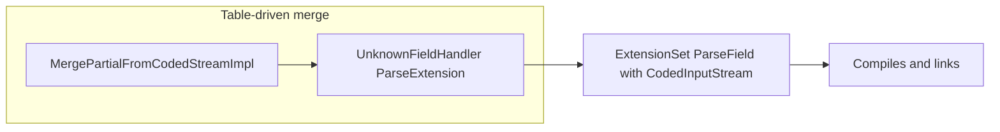

# Protobuf and third-party patch inventory

This document catalogs **go-zetasql–specific** changes layered on top of vendored Google code (primarily **protobuf**, plus a few **third-party** trees touched by the updater). It explains **why** each class of patch exists, how it interacts with [`internal/cmd/updater/main.go`](../internal/cmd/updater/main.go), and how to maintain or automate it when upgrading ZetaSQL or refreshing dependency snapshots.

## Source of truth and upgrade axis

- **Upstream ZetaSQL** pins third-party versions via Bazel. This repo mirrors those artifacts into [`internal/cmd/updater/cache/external/`](../internal/cmd/updater/cache/external/) and copies selected trees into [`internal/ccall/`](../internal/ccall/) according to `copyExternalLibMap` / `copyOutExternalLibMap` in the updater (for example `com_google_protobuf/src` → [`internal/ccall/protobuf/`](../internal/ccall/protobuf/)).
- Prefer a **single coherent revision** of protobuf for runtime headers, generated `*.pb.h` / `*.pb.cc`, and sources. Mixing files from different commits causes version checks (`PROTOBUF_MIN_*`), missing symbols, and subtle API skew.
- **`GO_ZETASQL_SKIP_PROTOBUF_COPY`**: when set to **`1`**, the updater **skips** copying `com_google_protobuf/src` into `internal/ccall/protobuf`, so local patches or an in-progress vendor refresh are preserved (see `copyExternalLibMapForRun()` in the updater). Use a **full** copy when intentionally refreshing protobuf from the cache.

## Stable mechanical patches (amalgamation / CGO)

These exist because protobuf is built here as a **single translation unit** included from [`internal/ccall/go-protobuf/protobuf/export.inc`](../internal/ccall/go-protobuf/protobuf/export.inc), not as many TUs like Google’s Bazel build. Upstream `port_def.inc` / `port_undef.inc` assume one include/undef pair per header; amalgamation breaks that unless we gate repeated includes.

### `port_def.inc` / `port_undef.inc`

- **Files**: [`internal/ccall/protobuf/google/protobuf/port_def.inc`](../internal/ccall/protobuf/google/protobuf/port_def.inc), [`internal/ccall/protobuf/google/protobuf/port_undef.inc`](../internal/ccall/protobuf/google/protobuf/port_undef.inc).
- **Mechanism**: After the standard file header comments, the main body is wrapped in:
  - `#ifdef GO_ZETASQL_PROTOBUF_AMALGAMATION_SKIP_PORT_DEF` / `#else` / `#endif` (port_def)
  - `#ifdef GO_ZETASQL_PROTOBUF_AMALGAMATION_SKIP_PORT_UNDEF` / `#else` / `#endif` (port_undef)
- **Effect**: The amalgamation TU includes `port_def.inc` **once** with the skip macros undefined so macros are defined; nested includes from other headers see the skip macro set and skip the body, avoiding duplicate macro definitions and paired `#undef` issues.
- **Maintenance**: A full copy of `com_google_protobuf` **overwrites** these files and **removes** the wrappers. Re-apply them after every bulk copy, and ensure there is exactly **one** closing `#endif` for each guard (duplicate `#endif` lines cause hard-to-read preprocessor errors).

### `export.inc` (amalgamation preamble)

- **File**: [`internal/ccall/go-protobuf/protobuf/export.inc`](../internal/ccall/go-protobuf/protobuf/export.inc).
- **Role**:
  - Defines **`GO_EXPORT(x)`** → `export_protobuf_##x` and **`InsertIfNotPresent`** → `protobuf_InsertIfNotPresent` to reduce symbol collisions when linking the CGO static archive with other code.
  - Includes `google/protobuf/port_def.inc` **once**, then defines `GO_ZETASQL_PROTOBUF_AMALGAMATION_SKIP_PORT_DEF` and `GO_ZETASQL_PROTOBUF_AMALGAMATION_SKIP_PORT_UNDEF` before pulling in protobuf `.cc`/`.h` sources in a defined order.
  - Includes `google/protobuf/stubs/macros.h` early so headers that expect `GOOGLE_DISALLOW_EVIL_CONSTRUCTORS` et al. compile in this TU.
  - Ends with `#undef GO_ZETASQL_PROTOBUF_AMALGAMATION_SKIP_PORT_UNDEF`, includes `port_undef.inc`, and cleans up export macros.

This file is **not** copied from upstream; treat it as part of the go-zetasql embedding layer.

## Updater: what is automated today vs gaps

[`applyPostCopyOverlays()`](../internal/cmd/updater/main.go) runs **after** copying external trees and applies **idempotent** string fixes, including:

| Area | File(s) | What it does |
|------|---------|----------------|
| ICU | [`internal/ccall/icu/common/bytesinkutil.h`](../internal/ccall/icu/common/bytesinkutil.h) | Adds `GO_ZETASQL_ICU_*` include guards around the file body. |
| ZetaSQL | `internal/ccall/zetasql/public/types/BUILD` | Appends a missing proto dependency line if absent. |
| ZetaSQL | `internal/ccall/zetasql/public/functions/date_time_util.cc` | Restores an `#undef FCT` after a specific `MakeEvalError` block when missing. |

**Gap (high value for automation):** protobuf **`port_def.inc` / `port_undef.inc` amalgamation guards are not re-applied here.** Any full refresh of `com_google_protobuf` should either run a dedicated post-step (see below) or be followed by a manual re-application of those wrappers.

## Local deltas that may track upstream over time

Some files under `internal/ccall/protobuf/` may carry **additional** edits beyond amalgamation guards—for example API surfaces that support `io::CodedInputStream` extension parsing, `ExtensionFinder` wiring, or inline helpers in headers. **On disk, search** for:

- `GO_ZETASQL`, `ExtensionFinder`, `CodedInputStream`-based `ParseField` overloads in [`extension_set.h`](../internal/ccall/protobuf/google/protobuf/extension_set.h) / [`extension_set.cc`](../internal/ccall/protobuf/google/protobuf/extension_set.cc) / [`extension_set_heavy.cc`](../internal/ccall/protobuf/google/protobuf/extension_set_heavy.cc).

Treat large or overlapping overload sets as **candidates to reconcile** with the exact protobuf revision pinned for your ZetaSQL upgrade: sometimes the durable fix is a **clean vendor snapshot** rather than preserving every local edit. After a refresh, **diff** these files against the new upstream and fold in only what amalgamation still requires.

## Symptoms of version skew (not “random compiler bugs”)

If you see errors such as:

- `#error` in generated `*.pb.h` about an **older protoc** vs headers,
- missing `PROTOBUF_*` macros or duplicate definitions from `port_def.inc`,
- missing or duplicate symbols in `ExtensionSet` / table-driven parsing,

assume **mixed revisions or incomplete post-copy patching** first. Re-copy a single protobuf tree, re-apply amalgamation guards, and regenerate or re-copy generated protos consistently.

## Upgrade playbook

1. Update the updater **cache** / pins so `com_google_protobuf` matches the ZetaSQL release you target.
2. Run the updater with `GO_ZETASQL_SKIP_PROTOBUF_COPY=1` when **preserving** local protobuf edits, or unset it when **forcing** a full refresh from cache.
3. Re-apply **amalgamation** patches to `port_def.inc` and `port_undef.inc` (or implement automation; see below).
4. Run `CGO_ENABLED=1 go test -count=1 ./internal/ccall/go-protobuf/protobuf/`, then broader tests as needed.
5. Inspect `extension_set*` and any other files previously touched for merge duplication or API drift.

## Future automation options

These are implementation choices for maintainers; none are required for a correct manual process.

| Approach | Idea | Tradeoffs |
|----------|------|-----------|
| **A. Updater hooks** | Add e.g. `applyProtobufAmalgamationPatches()` next to `applyPostCopyOverlays()`, using the same idempotent `replaceIfMissing` / `appendLineIfMissing` style. | Stable if anchored on unique substrings; must be updated if upstream rewrites those anchors. |
| **B. Patch files** | Store `git apply`/`patch -p1` patches under e.g. `internal/ccall/protobuf/patches/`. | Breaks when upstream context shifts; good for reviewable, explicit diffs. |
| **C. Anchor-based script** | Rewrite using stable comments (e.g. the “no include guard” paragraph in `port_def.inc`) rather than line numbers. | More resilient than line-based edits; still needs tests when protobuf changes structure. |

---

## Protobuf upgrade runbook (beyond amalgamation patches)

Use this when bumping **ZetaSQL** (and its pinned protobuf / Abseil) or when CGO fails after a vendor refresh. It complements the amalgamation rules above: first keep **one** coherent protobuf tree, then address **API** and **cross-package** skew.

### Blocking: table-driven merge and `CodedInputStream`

Amalgamation includes [`generated_message_table_driven_lite.cc`](../internal/ccall/protobuf/google/protobuf/generated_message_table_driven_lite.cc) and [`generated_message_table_driven.cc`](../internal/ccall/protobuf/google/protobuf/generated_message_table_driven.cc). Their `UnknownFieldHandler::*::ParseExtension` paths call `ExtensionSet::ParseField` with an **`io::CodedInputStream*`** (tag + stream + prototype + unknown-field sink).

Newer upstream protobuf may emphasize the **pointer + `ParseContext`** parser only. If your vendored headers drop the **`CodedInputStream` overloads**, the TU fails to compile or link even when amalgamation guards are correct.

**Preferred fix (compatibility layer):** restore or keep the **lite** overloads that delegate through `GeneratedExtensionFinder`, `FieldSkipper`, and `CodedOutputStreamFieldSkipper` (see [`wire_format_lite.h`](../internal/ccall/protobuf/google/protobuf/wire_format_lite.h)). Implement in [`extension_set.cc`](../internal/ccall/protobuf/google/protobuf/extension_set.cc) and declare in [`extension_set.h`](../internal/ccall/protobuf/google/protobuf/extension_set.h); full-runtime paths live in [`extension_set_heavy.cc`](../internal/ccall/protobuf/google/protobuf/extension_set_heavy.cc) (e.g. `UnknownFieldSetFieldSkipper`). Port from historical protobuf or from a single consistent upstream revision, adapting renames (`PROTOBUF_PREDICT`, `ExtensionInfo` layout, `Add*` / `descriptor` parameters).

**Larger alternative:** refactor table-driven merge to build `internal::ParseContext` + a zero-copy stream and call `ParseField(uint64_t tag, const char* ptr, …, ParseContext*)` only—only if restoring the compatibility layer is infeasible given current `Extension` internals.

**Validation:** `CGO_ENABLED=1 go test -count=1 ./internal/ccall/go-protobuf/protobuf/` until `ParseField` arity / overload errors are gone.



### Abseil C++ standard (go-absl CGO)

Packages under [`internal/ccall/go-absl/`](../internal/ccall/go-absl/) that set **`-std=c++11`** can fail Abseil’s `policy_checks.h` (C++14+). Align with **`c++17`** (or at least **`c++14`**) on any `bind_*.go` that compiles Abseil headers, consistent with [`internal/ccall/go-protobuf/protobuf/bind_linux.go`](../internal/ccall/go-protobuf/protobuf/bind_linux.go) and siblings.

### Updater and generator (ZetaSQL / parser / proto skew)

Parser errors (e.g. missing AST types or fields in generated headers) usually mean **vendored ZetaSQL C++** and **generated `.pb.*` / Go** are out of sync—not amalgamation alone.

1. Run [`internal/cmd/updater`](../internal/cmd/updater) with a populated **`cache/`** as required by the tool.
2. **Unset** `GO_ZETASQL_SKIP_PROTOBUF_COPY` (do **not** set `=1`) when you intend a **full** protobuf copy from cache for that upgrade.
3. Run [`internal/cmd/generator`](../internal/cmd/generator) so `includeDirs`, copied trees (e.g. `utf8_range`, protobuf), and generated Go stay aligned.
4. Re-check parser sources (e.g. [`parse_tree_serializer.cc`](../internal/ccall/zetasql/parser/parse_tree_serializer.cc)) against [`parse_tree.pb.h`](../internal/ccall/zetasql/parser/parse_tree.pb.h) after protos match the pinned tag (e.g. **2023.08.1**).

Commit large `internal/ccall` vendor updates separately from small CGO flag fixes, per conventional commits.

### Three-repository verification

After go-zetasql is green:

1. **[go-zetasql](../..)** — `go test ./...` (or narrow packages first).
2. **[go-zetasqlite](https://github.com/goccy/go-zetasqlite)** — same, after updating the `go-zetasql` module replace/version if needed.
3. **[bigquery-emulator](https://github.com/goccy/bigquery-emulator)** — same.

### Optional cleanup

- Remove or **gitignore** stray build artifacts (e.g. `libprotobuf_cgo.a` under `internal/ccall/go-protobuf/protobuf/lib/` if present).
- Reconcile [`.github/workflows/go.yml`](../.github/workflows/go.yml) if macOS or static-library steps were added for an abandoned static-archive approach.

### Risk notes

- Porting **`ParseField(CodedInputStream*)`** must stay consistent with current **`ExtensionInfo`** and **`ExtensionSet::Add*`** APIs; expect iterative compile fixes, not a blind copy-paste from old protobuf.
- Edits around **mutable default strings** / **`Arena`** in table-driven lite paths (e.g. [`generated_message_table_driven_lite.h`](../internal/ccall/protobuf/google/protobuf/generated_message_table_driven_lite.h)) can affect **non-empty default string** parsing; if tests regress, compare with [`arenastring.h`](../internal/ccall/protobuf/google/protobuf/arenastring.h) (`LazyString`, `InitExternal`, etc.).

---

**Related code**: updater [`internal/cmd/updater/main.go`](../internal/cmd/updater/main.go) (`copyExternalLibMapForRun`, `applyPostCopyOverlays`, `copyExternalLibMap`).

---

## Upgrade plan execution notes (protobuf / ZetaSQL refresh)

This section tracks the **“protobuf upgrade next steps”** plan: restore table-driven + `CodedInputStream` compatibility, align Abseil C++, run updater/generator, verify downstream modules, optional CI cleanup.

### Completed in this repo (vendor coherence)

| Item | Detail |
|------|--------|
| **ExtensionSet `CodedInputStream` overloads** | Keep the **`io::CodedInputStream*`-based** `ParseField` / `ParseFieldWithExtensionInfo` overloads and template that table-driven merge expects; **do not** declare the same overload set twice (parameter names `extendee` vs `containing_type` still count as one signature in C++). |
| **`MapEntryHelper` + `FromHelper`** | Some Bazel-pinned protobuf drops move **`MapEntryHelper`** out of [`map_entry_lite.h`](../internal/ccall/protobuf/google/protobuf/map_entry_lite.h) while [`generated_message_table_driven.h`](../internal/ccall/protobuf/google/protobuf/generated_message_table_driven.h) still references it. Restore the **table-driven facsimile** of a map entry (`_has_bits_`, `_cached_size_`, `key_`, `value_`) plus **`FromHelper`** for `TYPE_STRING` / `TYPE_BYTES` / `TYPE_MESSAGE` so `MapFieldSerializer` and deterministic map sorting compile. |
| **`EntryTypeTrait` on map fields** | `MapFieldSerializer` uses `MapEntryHelper<typename MapFieldType::EntryTypeTrait>`. Add **`typedef Derived EntryTypeTrait`** next to `EntryType` on [`MapFieldLite`](../internal/ccall/protobuf/google/protobuf/map_field_lite.h) and [`MapField`](../internal/ccall/protobuf/google/protobuf/map_field.h). |
| **`ArenaStringPtr` shims for lite table-driven** | [`generated_message_table_driven_lite.h`](../internal/ccall/protobuf/google/protobuf/generated_message_table_driven_lite.h) may call **`Destroy(ArenaStringPtr::EmptyDefault{}, arena)`**, **`UnsafeSetDefault`**, and **`MutableNoCopy(default_ptr, arena)`** while [`arenastring.h`](../internal/ccall/protobuf/google/protobuf/arenastring.h) only exposed the one-arg `MutableNoCopy`. Add nested **`EmptyDefault`**, **`UnsafeSetDefault(const std::string*)`**, **`MutableNoCopy(const std::string*, Arena*)`**, and **`Destroy(EmptyDefault, Arena*)`** in the amalgamation copy. |

**Sanity compile:** from repo root:

```bash
CGO_ENABLED=1 go test -count=1 ./internal/ccall/go-protobuf/protobuf/
```

(Package has no tests; a quick pass still builds the amalgamated protobuf TU.)

### Updater / generator (runbook commands)

From a populated [`internal/cmd/updater/cache/`](../internal/cmd/updater/cache/) (Bazel `external/` + `execroot/.../bin` layout the updater expects):

```bash
# Refresh ZetaSQL + third-party trees from cache. Omit protobuf copy if you are
# preserving local patches (otherwise the copy overwrites this doc’s fixes):
cd internal/cmd/updater
GO_ZETASQL_SKIP_PROTOBUF_COPY=1 go run .

cd ../generator
go run .
```

After any **`com_google_protobuf` full copy**, re-apply at minimum: **`port_def.inc` / `port_undef.inc` amalgamation guards**, **`export.inc`**, and the rows in the table above if upstream still omits them.

**Amalgamation (`go-protobuf/protobuf/export.inc`):** the bundle ends with `port_undef`, which clears all protobuf macros while `GO_ZETASQL_PROTOBUF_AMALGAMATION_SKIP_PORT_DEF` was still set — so later zetasql `*.pb.cc` in the same TU saw an empty `port_def.inc` (e.g. unknown `PROTOBUF_PRAGMA_INIT_SEG`). **Undef `GO_ZETASQL_PROTOBUF_AMALGAMATION_SKIP_PORT_DEF` immediately after that `port_undef`.** The amalgamation must **not** redefine the host `bind.cc` **`GO_EXPORT`** (ICU’s `U_ICU_ENTRY_POINT_RENAME` depends on it); protobuf symbol wrapping in this file uses **`GO_ZETASQL_PB_EXPORT(sym)`** (`export_protobuf_##sym`) instead.

**Abseil `optional` (generator [`config.yaml`](../internal/cmd/generator/config.yaml)):** Bazel lists `internal/optional.h` as a `src` for `absl/types/optional`, so the generator used to emit a second `#include` after `optional.h`. Under C++17, Abseil uses **`using std::optional`**, and that extra include conflicts. **`cclib.exclude_amalgamation_headers`** drops `absl/types/internal/optional.h` for that lib (it is already pulled in by `optional.h` when using the non-std implementation).

### Regenerating `parse_tree` (protoc vs vendored runtime)

Vendored C++ protobuf is **4.23.3** (`GOOGLE_PROTOBUF_VERSION` **4023003**). Use **protoc 23.3** (e.g. [releases](https://github.com/protocolbuffers/protobuf/releases/tag/v23.3)) — not `protoc` 25+ / 30+, which emit incompatible `*.pb.{h,cc}` for this tree. From **`internal/ccall`**:

```bash
protoc -I. -Iprotobuf --cpp_out=. zetasql/parser/parse_tree.proto
```

Use **`--cpp_out=.`** so outputs land in `zetasql/parser/`. Passing **`--cpp_out=zetasql/parser`** with `zetasql/parser/parse_tree.proto` nests files under `zetasql/parser/zetasql/parser/`.

### Verification (three repositories)

1. **go-zetasql** — `CGO_ENABLED=1 go test ./...` once parser/proto/flex amalgamation issues are resolved (see below).
2. **[go-zetasqlite](https://github.com/goccy/go-zetasqlite)** — update the `go-zetasql` replace/version, then `go test ./...`.
3. **[bigquery-emulator](https://github.com/goccy/bigquery-emulator)** — same.

### Known follow-ups (full `./...` on this branch)

These are **not** fixed by protobuf amalgamation alone; treat them as separate upgrade checklist items:

- **`utf8_validity.h`**: newer `parse_context.cc` / `wire_format_lite.cc` include it; vendor **`utf8_range`** (or equivalent) into [`internal/ccall/`](../internal/ccall/) and expose include paths in the relevant `bind_*.go` packages, or extend the updater **`copyExternalLibMap`** when the Bazel tree is available.
- **Generated `.pb.cc` / macros**: unknown **`PROTOBUF_PRAGMA_INIT_SEG`** / **`PROTOBUF_NAMESPACE_ID`** in a zetasql `*.pb.cc` after **`go-protobuf/export.inc`** usually means **amalgamation left `GO_ZETASQL_PROTOBUF_AMALGAMATION_SKIP_PORT_DEF` on** after the final `port_undef` — see **`export.inc`** notes above. If macros are present but still wrong, `.pb.*` may be from the **wrong protoc** vs **4023003** headers — regenerate with **protoc 23.3** or copy from the matching Bazel output.
- **Parser / flex amalgamation**: do not splice **`flex_tokenizer_base.inc`** on top of a full **`flex_tokenizer.flex.cc`** (generator **`add_sources`** for that pair was removed). Older failures from mixed **`darwin-fastbuild`** vs **`k8-fastbuild`** layouts used the same symptom (`yy_ec`, `yy_base`, …); keep a **single** generated lexer tree.
- **`parse_tree` skew**: serializer C++ referencing **`ASTWithClauseEntry`** / **`anonymization_options`** when **`parse_tree.pb.h`** does not match — rerun updater + generator against the same ZetaSQL revision until C++ and `.pb.h` agree.
- **Raw `internal/ccall/absl/strings`**: the vendored tree is not a stand-alone Go cgo package; [`strings.go`](../internal/ccall/absl/strings/strings.go) uses **`//go:build ignore`** so **`go test ./...`** does not treat `*.cc` as illegal in a non-cgo package.

### Optional cleanup

- No `libprotobuf_cgo.a` was present under `internal/ccall/go-protobuf/protobuf/lib/` in a typical tree; add to **`.gitignore`** if it appears from local experiments.
- Reconcile **[`.github/workflows/go.yml`](../.github/workflows/go.yml)** with the amalgamation-only CGO approach if macOS or static-archive steps are obsolete.
